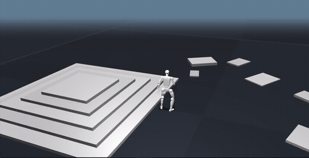
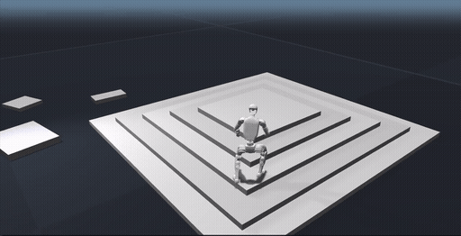

# PMT — Perceptive Motion Tracking

**Project page:** https://acodedog.github.io/perceptive-bfm/

<table>
  <tr>
    <td align="center"><br><sub><b>Cartwheel</b></sub></td>
    <td align="center"><br><sub><b>Backflip</b></sub></td>
  </tr>
</table>

PMT trains humanoid **motion-tracking** RL policies on [Isaac Lab](https://isaac-sim.github.io/IsaacLab/):
DeepMimic-style imitation, vision/terrain perception, cross-embodiment (SONIC), adversarial imitation
(ADD), and **teacher → distill → finetune** pipelines. Everything is **config-driven**: a task
*selects* independent axes (`robot` / `terrain` / `motion` / `obs` / `reward` / `network` /
`algorithm` / `stage`) and the builder *derives* the coupled ones, failing loud on invalid combos.

---

## Install

PMT runs **inside an Isaac Lab Python environment** — it does not vendor Isaac Sim / Isaac Lab. Get a
working Isaac Lab install first, then install PMT (editable) into that env:

```bash
conda activate <isaac-lab-env>           # the env that has Isaac Lab + Isaac Sim
export OMNI_KIT_ACCEPT_EULA=YES          # accept the Omniverse EULA for headless launches
cd /path/to/PMT
python -m pip install -e .               # installs the motion_tracking_rl RL core
```

Run all commands from the repository root (`pmt_tasks/`, `configs/`, `scripts/` are used in place).

**Prerequisites:** an importable `isaaclab` / `isaaclab_tasks`, Python ≥ 3.10, the Unitree G1 robot
assets (resolved via `PMT_ASSET_DIR` — not vendored), and per-task motion `*.npz` clips.

**Paths.** PMT never hard-codes machine paths: `configs/paths.yaml` carries profile-selected roots
and each reads a `PMT_*` env override. The key ones:

| Variable | Points to |
| --- | --- |
| `PMT_PROFILE` | Selects the `paths.yaml` block (`local` \| `cluster`, default `local`). |
| `PMT_DATA_ROOT` | Meshes/terrain assets and (default) logs. |
| `PMT_MOTION_ROOT` | Standalone flat motion clips. |
| `PMT_DATASET_ROOT` | Parent of the `terrain/` + `sonic/` clip trees. |

The full env-var table (including per-task overrides) lives in [`docs/USAGE.md`](docs/USAGE.md).

---

## Quickstart

Train the standard flat multi-motion G1 task:

```bash
python scripts/train.py --task PMT-G1-MultiMotionV2-Flat-v0 \
  --num_envs <n> --headless --max_iterations <iters>
```

Checkpoints land under `logs/rsl_rl/<experiment_name>/<run_name>/model_<iteration>.pt`. Play a
trained checkpoint on a motion file or directory:

```bash
python scripts/play.py --task PMT-G1-MultiMotionV2-Flat-v0 \
  --num_envs 1 --resume_path <checkpoint.pt> \
  --motion_file <motion-file-or-dir> --headless --max_steps 300
```

`scripts/train.py` dispatches the runner class from the derived `runner` axis — distillation tasks
route to `DistillationRunner`, on-policy tasks to `OnPolicyRunner`, same entrypoint. Common flags:
`--num_envs`, `--max_iterations`, `--seed`, `--profile local|cluster`, `--resume` /
`--resume_path <ckpt.pt>`, `--headless`.

---

## Pretrained models

Ready-to-use G1 policies ship under [`checkpoints/pretrained/`](checkpoints/pretrained/), tracked
with **git-lfs**:

```bash
git lfs install          # once
git lfs pull             # fetch the .pt / .onnx files after cloning
```

| File | Task / gym id | Network | reward |
| --- | --- | --- | --- |
| `multimotionv2_flat.pt` | `PMT-G1-MultiMotionV2-Flat-v0` | ActorCritic (MLP) | 40.9 |
| `multimotionv2_streaming_flat.pt` | `PMT-G1-MultiMotionV2-Streaming-Flat-v0` | ActorCritic (MLP) | 39.5 |
| `multimotionv2_adaptive_flat.pt` | `PMT-G1-MultiMotionV2-Adaptive-Flat-v0` | ActorCritic (MLP) | 46.4 |
| `multimotionv2_uniform_flat.pt` | `PMT-G1-MultiMotionV2-Uniform-Flat-v0` | ActorCritic (MLP) | 46.4 |
| `bpo_multimotionv2_flat.pt` | `PMT-G1-BPO-MultiMotionV2-Flat-v0` | ActorCritic (MLP) | 33.7 |
| `fpo_plus_singleclip_flat.pt` | `PMT-G1-FPOPlus-SingleClip-Flat-v0` | DiffusionActorCritic | 39.9 |
| `add_multimotion_flat.pt` | `PMT-ADD-MultiMotionV2-Flat-v0` | ActorCritic + discriminator | 18.0¹ |
| `rgmt_flat.pt` | `RGMT-G1-v0` | TransformerActorCritic | 33.5 |
| `perceptive_motion_token_tracker.pt` | `PMT-PerceptiveMotionTokenTracker-G1-v0` | PerceptiveMotionTokenTracker | 80.9 |
| `pcrbt_100style.pt` | `PMT-PCaRBT-100style-G1-v0` | PerceptiveResidualBehaviorTokenTracker | 62.4 |
| `walkdance_bigmap_teacher.pt` | `PMT-WalkDanceBigMap-G1-v0` | TransformerActorCritic | 86.6 |
| `sonic_onnx/` | `PMT-SONIC-G1-MultiMotionV2-Flat-v0` | SONIC (official ONNX) | — |

¹ ADD's `Train/mean_reward` is intentionally small (adversarial imitation); the run is full-length and healthy.
`reward` = max `Train/mean_reward`. **BFM-Zero** ships no checkpoint (its FB-CPR runner produced none).

```bash
python scripts/play.py --task PMT-G1-MultiMotionV2-Flat-v0 \
  --resume_path checkpoints/pretrained/multimotionv2_flat.pt --num_envs 16
```

See [`checkpoints/pretrained/README.md`](checkpoints/pretrained/README.md) for provenance and
per-checkpoint task/data requirements.

---

## Demo motion data

A 100-pair sample of terrain-anchored clips ships under
[`assets/motions/`](assets/motions/README.md) (git-lfs) so the terrain / distill tasks run
out-of-the-box: `terrain_mocaphouse/walk_dance1sub2start/{raw,optimized}/` (100 matched
`raw`↔`optimized` pairs — the distill pipeline uses `optimized` as the teacher reference and
`raw` as the student reference). Point PMT at it:

```bash
git lfs pull                                          # fetch the .npz clips
export PMT_TERRAIN_MOTION_ROOT=$(pwd)/assets/motions  # demo clips (from the repo root)
export PMT_TERRAIN_ASSET_DIR=$(pwd)/assets/terrain    # big_map .stl mesh (shipped under assets/terrain/)
python scripts/play.py --task PMT-WalkDanceBigMap-G1-v0 \
  --resume_path checkpoints/pretrained/walkdance_bigmap_teacher.pt --num_envs 4
```

See [`assets/motions/README.md`](assets/motions/README.md) for details.

---

## TCRS — terrain motion generation

[TCRS](TCRS/README.md) is the terrain-adaptive motion optimizer (MPPI). It takes a **flat-ground
motion clip** plus a **terrain scene XML** and produces the **terrain-optimized** version of that
motion for the G1 — feet are re-placed onto stairs/stones via an MPPI swing planner + Jacobian IK,
and the pelvis height is re-targeted. PMT consumes the resulting `optimized/` clips as the teacher's
reference motions (the `raw/` clips feed the vision student).

```
 flat motion .npz  +  terrain scene .xml   ──TCRS──▶   raw/ + optimized/ + ghost/  *.npz
```

See [`TCRS/README.md`](TCRS/README.md) for the CLI and arguments.

---

## Task catalog

Train with `scripts/train.py --task <id> …`; play with `scripts/play.py --task <id> --resume_path
<ckpt.pt> --motion_file <npz-or-dir> …`. Full per-task command forms are in [`docs/USAGE.md`](docs/USAGE.md).

| Family | Gym ids |
| --- | --- |
| Motion-tracking PPO (flat MLP) | `PMT-G1-MultiMotionV2-Flat-v0` (+ `-Uniform-`, `-Adaptive-`, `-Streaming-`, `-100style-`, `-Streaming-100style-` variants) |
| Transformer / terrain | `PMT-SteppingStone-G1-v0`, `PMT-Backflip-G1-v0`, `PMT-TerrainFlatMix-G1-v0`, `PMT-WalkDanceBigMap-G1-v0`, `PMT-CartwheelBigMap-G1-v0` |
| Distillation / perceptive | `PMT-Distill-SteppingStone-G1-v0`, `PMT-Distill-SteppingStone-LatentAnchor-G1-v0`, `PMT-PerceptiveMotionTokenTracker-G1-v0`, `PMT-PCaRBT-G1-v0`, `PMT-PCaRBT-100style-G1-v0` |
| Other algorithms | `PMT-G1-BPO-MultiMotionV2-Flat-v0`, `PMT-ADD-MultiMotionV2-Flat-v0`, `PMT-G1-FPOPlus-SingleClip-Flat-v0`, `PMT-SONIC-G1-MultiMotionV2-Flat-v0`, `RGMT-G1-v0` |
| BFM-Zero (separate runner) | `BFM-Zero-Flat-MultiMotionV2-G1-v0` via `scripts/bfm_zero/train.py` |

See [`pmt_tasks/env_cfgs/README.md`](pmt_tasks/env_cfgs/README.md) for the per-family env cfgs.

---

## Repository layout

```
PMT/
├── configs/                # source of truth: axis-group YAMLs + one task composition per experiment
├── motion_tracking_rl/     # the RL core (algorithms, networks, runners, compat matrix, bfm_zero/)
├── pmt_tasks/              # task layer: builder, derive, registry_gym, mdp/, env_cfgs/, robots/
├── scripts/                # train.py, play.py, bfm_zero/, submit/, mjlab_*, ...
├── TCRS/                   # terrain-adaptive motion optimizer (MPPI) — generates optimized clips
├── checkpoints/pretrained/ # git-lfs pretrained G1 policies
├── tests/                  # pure test suite + runtime gate scripts
├── cluster_yaml/           # md_rl cluster job templates
└── docs/                   # USAGE.md, ARCHITECTURE.md, compat_matrix.md, MJLAB_BACKEND_PLAN.md
```

`configs/` is the source of truth — see [`configs/README.md`](configs/README.md) for the
config-author guide and [`docs/ARCHITECTURE.md`](docs/ARCHITECTURE.md) for the design.

---

## Further reading

- [`docs/USAGE.md`](docs/USAGE.md) — full env-var table, per-task command forms, the teacher →
  distill → finetune pipeline, SONIC ONNX, BFM-Zero, and how to add a task / motion / robot / network.
- [`docs/ARCHITECTURE.md`](docs/ARCHITECTURE.md) — axis taxonomy, derivation table, layering contract.
- [`docs/compat_matrix.md`](docs/compat_matrix.md) — generated algorithm × network compatibility matrix.
- [`docs/MJLAB_USAGE.md`](docs/MJLAB_USAGE.md) — **how to run PMT on the mjlab (MuJoCo-Warp) backend**: convert clips, eval/view a trained ckpt, select the backend.
- [`docs/MJLAB_BACKEND_PLAN.md`](docs/MJLAB_BACKEND_PLAN.md) — MuJoCo/mjlab backend port plan + status (design doc).
- [`docs/MOTION_DATA_FORMAT.md`](docs/MOTION_DATA_FORMAT.md) — the `.npz` motion-clip contract (keys, shapes, body/joint order) the motion command consumes.
- [`pmt_tasks/env_cfgs/README.md`](pmt_tasks/env_cfgs/README.md) — released task families + env cfgs.
- [`TCRS/README.md`](TCRS/README.md) — terrain-adaptive motion generation.
- [`checkpoints/pretrained/README.md`](checkpoints/pretrained/README.md) — pretrained model table + provenance.

---

## License

PMT's own code is released under the **BSD 3-Clause License** (see [`LICENSE`](LICENSE)). PMT also
vendors/derives from upstream projects under their own licenses — see
[`THIRD_PARTY_LICENSES`](THIRD_PARTY_LICENSES) for the full inventory. **Note:** the bundled BFM-Zero
(FB-CPR-Aux) code in `motion_tracking_rl/bfm_zero/_vendor/` is **CC BY-NC 4.0 (NonCommercial)**, so
the repository as distributed is for **non-commercial / research use** unless those paths are removed.
